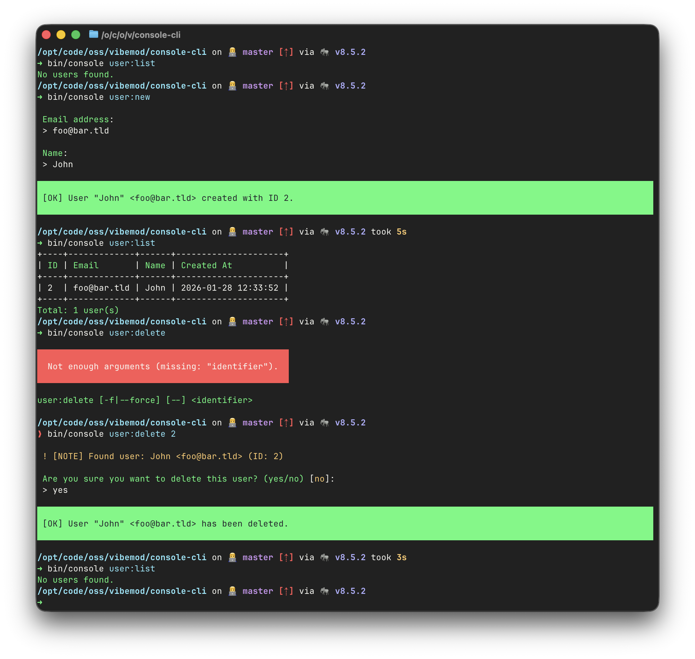

# Console CLI

Symfony Console CLI application using Contributte bootstrap with Doctrine ORM and SQLite database.

## Prerequisites

- PHP 8.4 or higher
- Composer
- SQLite (included with PHP)

## Installation

```bash
# Create local config
make init

# Install dependencies
make install

# Prepare runtime dirs
make setup
```

## Configuration

Nette application is configured in `config/config.neon`.

You can override parameters in `config/local.neon`:

```neon
parameters:
    # Add your parameters here

services:
    # Add your services here
```

## Development

### CLI

```bash
make console
```

### User Commands

```bash
# List all users
bin/console user:list

# Create a new user
bin/console user:new --email "user@example.com" --name "User Name"

# Show a user by ID or email
bin/console user:show 1
bin/console user:show user@example.com

# Delete a user by ID or email
bin/console user:delete 1 --force
bin/console user:delete user@example.com --force
```

### DevTasks

```bash
# Quality assurance (coding standards + static analysis)
make qa

# Run coding standards check
make cs

# Fix coding standards automatically
make csf

# Run static analysis with PHPStan
make phpstan

# Run test suite
make tests

# Run with coverage report
make coverage
```

## Demo

### Terminal



## Resources

- [Contributte](https://contributte.org)
- [Nette Framework](https://nette.org)
- [Doctrine ORM](https://www.doctrine-project.org)
